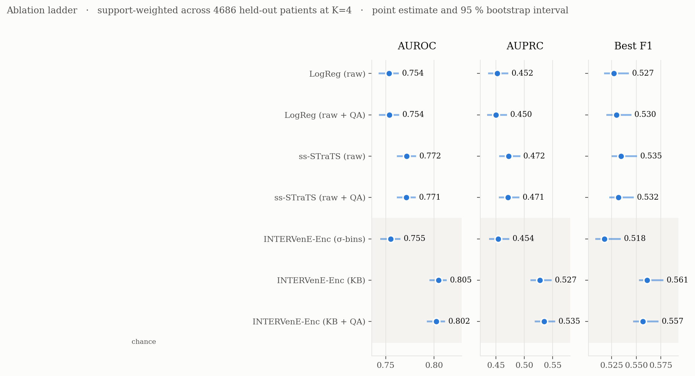
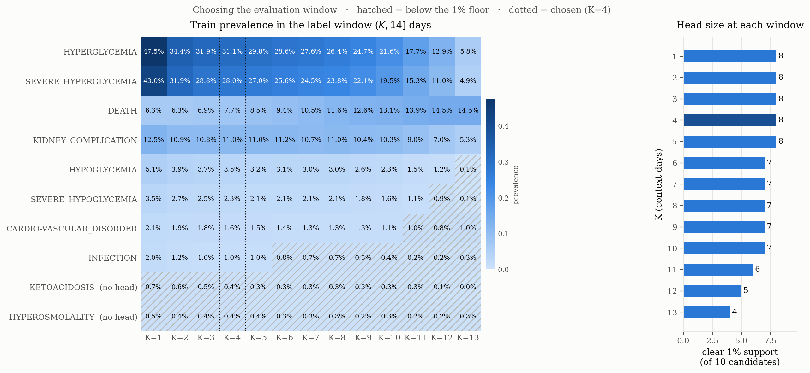
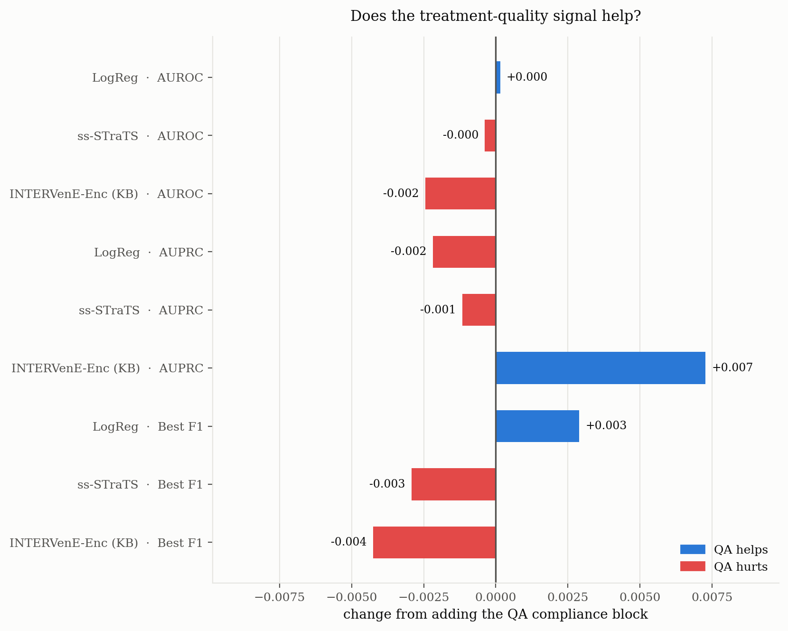
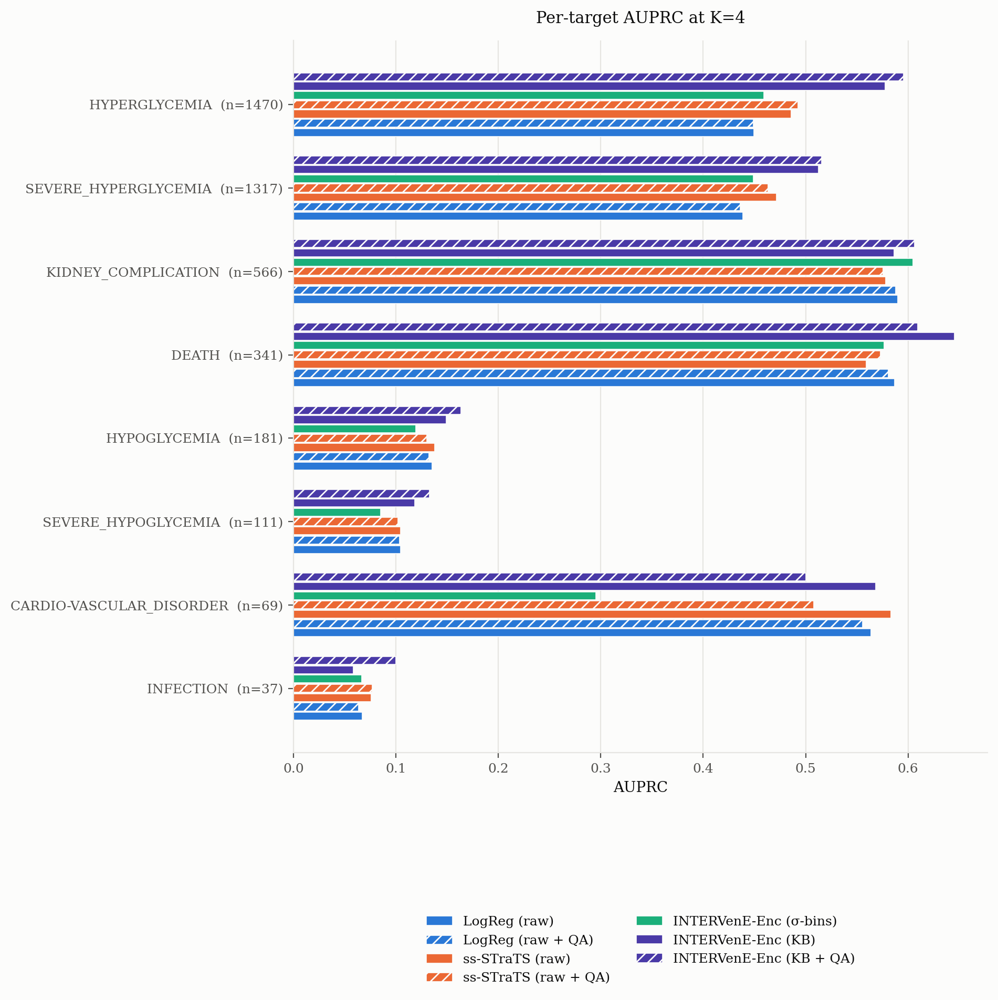
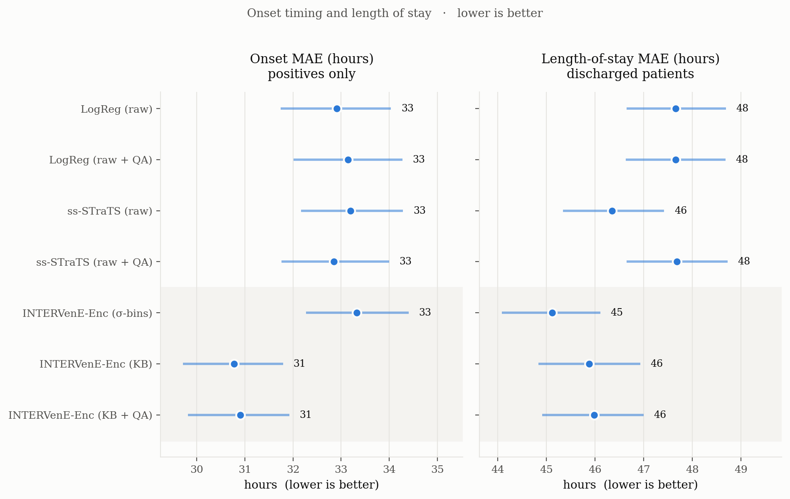

# Results

Frozen outputs from the Kineret transferability run reported in the thesis
(Section: *Predictive Models on the Kineret Cohort, RQ6*). All seven arms were
run **once**, at the configuration deployed on MIMIC-IV, with no per-cohort
tuning — the question is transferability, not best achievable performance.

## Run at a glance

| | |
|---|---|
| Cohort | Kineret — six Israeli hospitals |
| Training samples | **179,141** (one per admission × context window, K = 1…13) |
| Validation admissions | 4,600 |
| Test admissions | **4,686** |
| Split | by patient (person-grouped) |
| Evaluation window | K = 4 days |
| Label horizon | (K·24, 14·24] hours from admission |
| Prevalence threshold | 1% at K = 4 → 8 of 10 candidate complications keep a head (hyperosmolality and ketoacidosis do not) |
| Intervals | 95% patient-level bootstrap, 2 000 resamples |
| Exact config | [`full_bench_results/study_config.json`](full_bench_results/study_config.json) |

---

## The ladder — the headline result



Support-weighted performance across the seven arms on 4,686 held-out patients
at K = 4. Rungs 5 → 6 isolate the knowledge base; 6 → 7 the treatment-quality
signal.

| Rung | Arm | AUROC | AUPRC | Best F1 | Onset MAE (h) | LoS MAE (h) |
|---|---|---|---|---|---|---|
| 1 | LogReg | 0.754 [0.743, 0.764] | 0.452 [0.436, 0.472] | 0.527 | 32.9 | 47.7 |
| 2 | LogReg + QA | 0.754 [0.743, 0.764] | 0.450 [0.434, 0.469] | 0.530 | 33.1 | 47.7 |
| 3 | ss-STraTS | 0.772 [0.762, 0.781] | 0.472 [0.456, 0.493] | 0.535 | 33.2 | 46.4 |
| 4 | ss-STraTS + QA | 0.771 [0.762, 0.781] | 0.471 [0.455, 0.491] | 0.532 | 32.8 | 47.7 |
| 5 | INTERVenE-Enc (σ-bins) | 0.755 [0.744, 0.765] | 0.454 [0.438, 0.473] | 0.518 | 33.3 | **45.1** |
| **6** | **INTERVenE-Enc (KB)** | **0.805 [0.795, 0.813]** | 0.527 [0.511, 0.548] | **0.561** | **30.8** | 45.9 |
| 7 | INTERVenE-Enc (KB + QA) | 0.802 [0.793, 0.811] | **0.535 [0.518, 0.554]** | 0.557 | 30.9 | 46.0 |

**The architecture transfers.** INTERVenE-Enc on knowledge-based abstractions
leads every arm on AUROC, best F1 and onset error, at a support-weighted
AUPRC of 0.527 against 0.472 for the best raw-stream baseline — non-overlapping
intervals. The KB+QA arm edges it on AUPRC alone (0.535), separated by less
than one interval width.

**The knowledge base does more here than it did on MIMIC-IV.** Swapping it
for σ-bins costs 0.073 AUPRC and drops the arm to the logistic-regression
floor. The same substitution on MIMIC-IV was within noise. On the data the
knowledge base was authored for, the clinical knowledge is doing predictive
work, not only interpretive work.

---

## Target support — why K = 4



Positive counts and prevalence per candidate outcome across context windows.
The 1% prevalence threshold is what keeps hyperosmolality and ketoacidosis
out at K = 4 — both fall below it before enough history has accrued to score
them reliably. Choosing the evaluation window from this table, before
training, is the reason the results in the paper are a table and not a
surface.

CSV: [`fig1_target_support.csv`](full_bench_results/figures/fig1_target_support.csv).

---

## Does the adherence signal help? — not measurably in aggregate



Change from adding the aggregated QA compliance block, per model and metric.

Every change sits at the third decimal place with overlapping intervals. The
largest is INTERVenE-Enc's **+0.007 AUPRC** — the only arm that receives the
compliance patterns as temporal tokens rather than only as context.

The model *does* use them. Sparse-transcoder attribution (thesis
Figure *kineret_xai_qa*, not reproduced here) puts `*_PATTERN` tokens among
the top drivers for seven of eight outcomes — routine glucose monitoring for
death and kidney complication, basal-dosage / metformin-continuation for the
glycemic endpoints, reduced basal insulin after hypoglycemia for severe
hypoglycemia. The signal is read and assigned weight; it simply does not
change the aggregate metrics. Compliance scores are derived deterministically
from the same abstractions, so they are close to what the model already
extracts for itself — available and used, but carrying little the interval
stream does not.

---

## Per-outcome AUPRC — where the aggregate ordering comes from



Per-outcome AUPRC across the seven arms, ordered by positive count.

| Outcome | n₊ | LR | LR+QA | ST | ST+QA | σ | KB | KB+QA |
|---|---:|---:|---:|---:|---:|---:|---:|---:|
| Hyperglycemia | 1470 | 0.450 | 0.449 | 0.486 | 0.493 | 0.459 | 0.578 | **0.595** |
| Severe hyperglycemia | 1317 | 0.439 | 0.436 | 0.472 | 0.463 | 0.449 | 0.513 | **0.516** |
| AKI / kidney complication | 566 | 0.590 | 0.588 | 0.578 | 0.576 | 0.605 | 0.587 | **0.606** |
| Death | 341 | 0.587 | 0.581 | 0.559 | 0.573 | 0.577 | **0.645** | 0.609 |
| Hypoglycemia | 181 | 0.135 | 0.132 | 0.138 | 0.130 | 0.119 | 0.149 | **0.163** |
| Severe hypoglycemia | 111 | 0.104 | 0.103 | 0.104 | 0.102 | 0.085 | 0.119 | **0.133** |
| MI / cardiovascular | 69 | 0.564 | 0.556 | **0.583** | 0.508 | 0.295 | 0.568 | 0.500 |
| Infection | 37 | 0.067 | 0.064 | 0.076 | 0.077 | 0.067 | 0.058 | **0.100** |

The aggregate ordering is carried by the two frequent glycemic outcomes,
where the knowledge-based arms gain most — hyperglycemia 0.578 against 0.486
for ss-STraTS; severe hyperglycemia 0.513 against 0.472. Death is the only
outcome where KB without QA leads outright (0.645).

**Below roughly 200 positives, the arms stop separating.** Infection (37),
MI / cardiovascular (69) and severe hypoglycemia (111) sit near their
prevalence floors throughout; the single largest swing in the table — the
σ-bin arm at 0.295 on cardiovascular against 0.564 for logistic regression —
rests on 69 events and should not be read as an ordering. Weighting all eight
outcomes equally lowers every figure (macro AUPRC 0.332 → 0.403) but leaves
the arm ranking unchanged.

Also here as PNG/PDF/CSV:
[`fig4_per_target_auroc.*`](full_bench_results/figures/) for the AUROC view.

---

## Onset and LoS



Onset MAE is conditional on occurrence (positives only). The KB arms tighten
onset by ~2 hours over the raw-stream arms (30.8 h vs 32.9–33.3 h). LoS
error is close across the ladder (45.1 h to 47.7 h); the σ-bin arm has the
lowest LoS despite the weakest risk performance — the two heads share only
the encoder.

For outcomes with fewer than five positives per bootstrap draw the onset
interval collapses toward a point and reads as precision — those rows are
flagged `ci_reliable = False` in the per-outcome CSVs; kept, not hidden, but
not to be quoted alone.

---

## Layout

```text
results/
├── full_bench_results/                   # the run behind the thesis numbers
│   ├── benchmark_summary.csv             # one row per arm, all metrics + intervals
│   ├── study_config.json                 # the exact configure_study() call
│   ├── run_ladder_log.csv                # arm-by-arm training log
│   ├── benchmark.ipynb                   # notebook snapshot at run time
│   ├── MANIFEST.txt                      # every file and its size
│   ├── figures/                          # fig1–fig5 as PNG + PDF + CSV, plus derived tables
│   ├── runs/<arm>/{noqa,qa}/             # per-arm predictions, per-outcome metrics, bootstrap
│   │                                     #   logreg/*/coefficients.csv holds the LR coefficients
│   └── training_curves/{k4_noqa,k4_qa,std}/
└── transformers-results-old-with-xai/    # earlier ss-STraTS runs (QA / no-QA) kept for
                                          #   their attention / XAI notebooks; superseded
                                          #   by full_bench_results but preserved for reference
```

Predictions (`test_predictions.csv`) and checkpoints (`checkpoint_best.bin`)
are **not** shipped — cohort-derived files never leave the machine. Per-outcome
metrics, bootstrap intervals and LR coefficients are.

---

## Reproducing

Not from this folder alone — the run needs the Kineret extract, which is not
in the repo. To reproduce the numbers, run `notebooks/benchmark.ipynb` at the
`study_config.json` above. The notebook resumes: an arm with a
`test_predictions.csv` is skipped, so partial runs continue where they stopped.
